Tutorial: Desenvolvendo um Formulário de Cadastro Responsivo com Tailwind CSS
1. Descrição do Objetivo
O objetivo deste tutorial é ensinar como desenvolver um formulário de cadastro responsivo utilizando o Tailwind CSS, um framework de CSS utilitário. Vamos construir um formulário simples, mas completo, que será fácil de customizar e manter, além de ser responsivo para diferentes tamanhos de tela (desktop e mobile).

2. Descrição para Instalação dos Softwares Necessários
Para começar o desenvolvimento, você precisará de algumas ferramentas essenciais. Aqui estão as instruções de instalação:

2.1. Node.js
O Node.js é necessário para gerenciar pacotes e dependências como o Tailwind CSS.

Baixe e instale o Node.js através do site oficial: https://nodejs.org
Verifique a instalação no terminal com o comando:
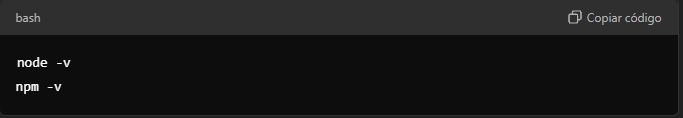

2.2. Editor de Código
Escolha um editor de código de sua preferência, como:
VSCode: Baixe em https://code.visualstudio.com/

2.3. Tailwind CSS
Instalaremos o Tailwind CSS através do npm (gerenciador de pacotes do Node.js). Vamos instalar também o PostCSS e o Autoprefixer para processar o CSS.

3. Passo-a-Passo para o Desenvolvimento

Agora que temos tudo configurado, vamos para o passo a passo de criação do projeto.

3.1 - Inicializando o Projeto
Abra o terminal e navegue até a pasta onde deseja criar o projeto.

Inicialize um novo projeto Node.js com o seguinte comando:
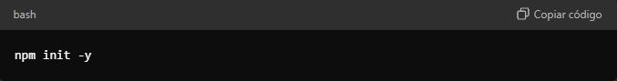

Isso gerará o arquivo package.json que gerenciará nossas dependências.

Passo 2 - Instalando o Tailwind CSS
Instale o Tailwind CSS, PostCSS e Autoprefixer:
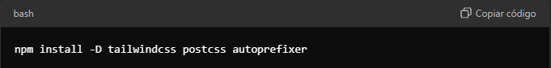

Geração do arquivo de configuração do Tailwind:

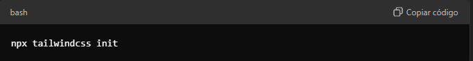

Isso cria o arquivo tailwind.config.js que gerenciará a personalização do Tailwind.

Passo 3 - Configuração do Tailwind
No arquivo tailwind.config.js, adicione:
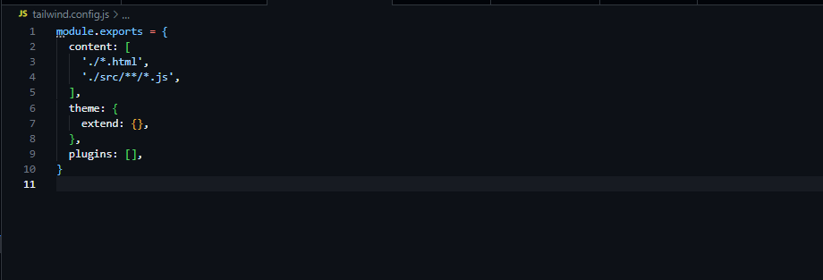

Passo 4 - Criando o CSS Base
Crie a pasta src e, dentro dela, o arquivo input.css.
Adicione o seguinte no input.css:
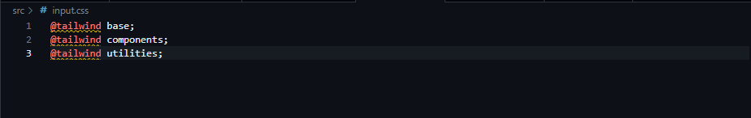

Passo 5 - Configuração do Script de Build no Local
No package.json, adicione o seguinte script:
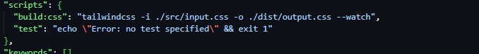

Passo 6 - Criando o Formulário em HTML
Na raiz do projeto, crie o arquivo index.html com a mesma estrutura usada no Codespaces (conforme explicado anteriormente).
![alt text]./img_readme/(image-7.png)
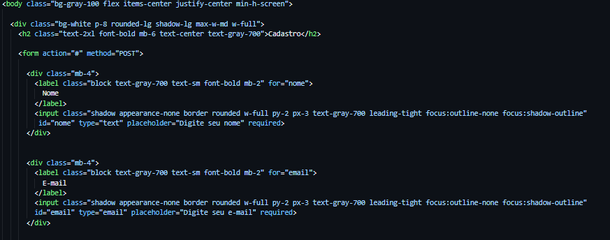
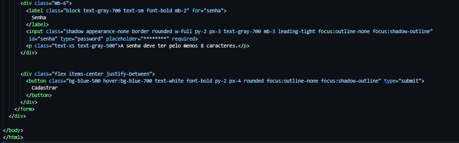

Passo 7 - Executando o Build no Ambiente Local
Execute o comando de build no terminal:

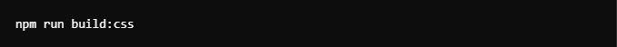

Passo 8 - Visualizando o Projeto Localmente
Abra o arquivo index.html no navegador para visualizar o formulário.
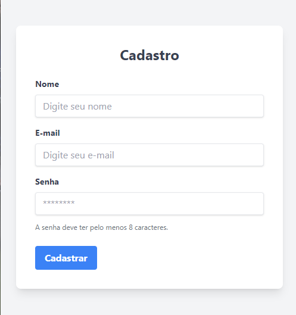
